# Pokedex


[Link to live Site](https://pokedex-pp3.herokuapp.com/)

Pokedex is a python based web application run in a mock terminal. Based on the popular kids' television series, Pokémon, Pokedex attempts to replicate, in some regards, the Pokédex, a tool used by trainers in the television and video game series. In the show, this device is used to capture and provide information to the characters about the Pokémon they encounter. This python pokedex offers similar functionality, through calls to [PokeAPI](https://pokeapi.co/), an API with a comprehensive database detailing everything from the main game series. 

This python Pokedex allows the user to fund information about the first generation of the Pokémon series. The first generation comprises of the first 150 pokémon introduced and information linked to the first release of Pókemon games for the Nintendo Gameboy ([Pokémon Red, Blue](https://en.wikipedia.org/wiki/Pok%C3%A9mon_Red_and_Blue) & [Yellow](https://en.wikipedia.org/wiki/Pok%C3%A9mon_Yellow). The reason for limiting the information provided in this pokedex is that the large number of games and generations released since the first generation back in the 1990s means the number of results returned from API calls would have made for an overwhelming user experience, but also, as a child of the 90s, it is a point of personal preference.

Beyond, finding information about the first generation of Pokémon, users can encounter 'wild' Pokémon and catch them, mimicking the games the tv series, and view their collection of Pokémon whenever they decide to return to the application.

## User Experience:

* ## Vision:
 The idea and aim of the pokedex is to create a fun and informative web application from which users can find some basic information about the first generation of Pokémon. Whether a user is just curious for certain fundamental information about a Pokémon, or is new to Pokémon and wants to see some general info, pokedex aims to act as encyclopaedia of sorts which pulls out information quickly and easily for the user. There should be no prerequisite knowledge required on the user's end. Users who simply want to learn something new should be able to extract info through their inputs, even if it involves an element of randomness on their part.
 
 In addition to this, the app aims to play to the idea which drove the Pokémon series and games in the first place: catching and collecting Pokémon. The app should allow the user to play the role of trainer and seek out and 'catch' their favourite Pokémon, to be viewed at any stage when they return to the application.
 
 * ## Target Audience:
  Centring the app around the first generation of the series, the supposed target audience would be any user who, like myself, has an affiliation with the series from childhood, or perhaps recent times. However, this app is also aimed more widely at anyone curious about Pokémon or anyone familiar with the Gameboy games. This application offers a stripped back version of some of the facets of the original games without the need to spend time progressing through an entire video game.
 
 * ## User stories:
  As a user:
  1. I want to easily understand the purpose of the application and to navigate easily to all relevant sections.
  2. I want to find the desired information about specific Pokémon quickly and simply.
  3. I want to collect my favourite Pokémon and view those which I have caught.
  4. Who is a new fan of the series, I want to simulate some aspects of the life of a Pokémon trainer as seen in the games and tv series.
  5. Who grew up watching Pokémon, I want to feel a sense of nostalgia recalling a pleasant childhood memory.
  
  As a returning user:
  1. I want my previous use of the app to be saved and reflected when viewing the Pokémon I have caught in the past.
  2. I want to see if there are new features added to the application.
 
  As a site owner:
  1. I want to provide an easy, enjoyable and reactive experience for the user.
  2. I want a way to monitor and save past usage of users.
  3. I want to provide a real world simulation of the Pokédex tool used in the games and tv series.
 
 * ## UX Plane:
1. ### Strategy:
  * Build a python based web app which runs through a mock terminal for fans, or those curious, of Pokémon.
  * Make a simple application with straight-forward features to educate the user about the world of Pokémon.
2. ## Scope:
  * Build the application on a single page site and have it run in a mock terminal.
  * Build an application with no learning curve or prior knowledge required.
  * Design an application which intuitively allows the user to access the feature without any difficulty.
  * Design a visually pleasing application which provides feedback to the user and handles all input errors.
3. ## Structure:
  * Build the entire app in one terminal.
  * Build an application which flows from one feature to the next and allows the user to loop back to the main menu without the need to restart the application.
  * Make menu and input options clear and consistent throughout each section of the application.
 4. ## Skeleton:
  * This application will flow from section to section based on user input.
  * Before proceeding with coding this site, I made a simple flow chart to represent the journeys users could take. This would be developed further while building the    application.
    1. Initial flow chart:
      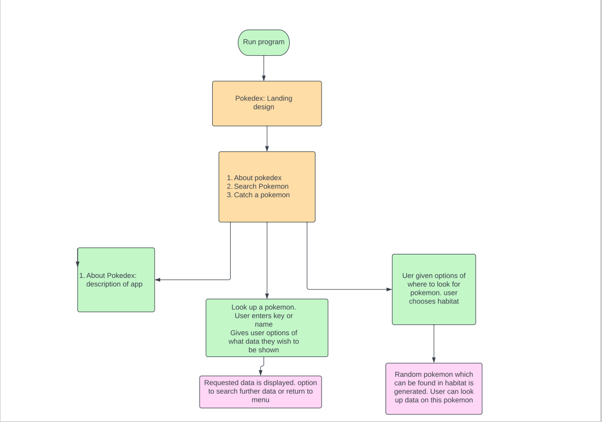
      
    2. Further developed during build:
5. ## Surface:
  * This application should provide basic menus with straight forward options for user input.
  * Should provide feedback to the user where API calls cause slight delays in returning information to the terminal.

* ## Features:
  * ### Existing features:
   1. #### Enter trainer name:
    On running the application, the user is first asked to input their 'trainer name'. This acts as a username for the app. The user is then welcomed to the application and if they have used it previously, is welcomed back.
    
    
    The trainer's name is stored in the app-associated google sheet, in the top row of each worksheet in order to store actions of the user, so they can be accessed for future uses.
    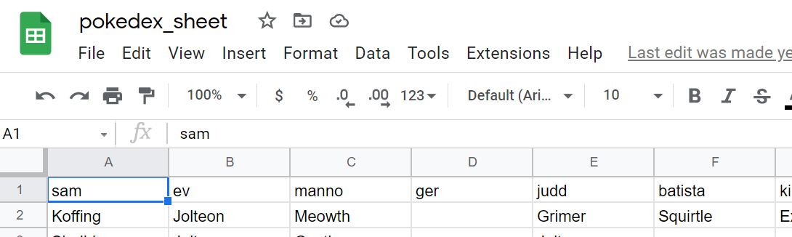
    
   2. #### Landing image:
    After the user has entered their trainer name, the landing image displays for 2 seconds displaying the name of the application and a stylised image of a Pokéball from the series.
    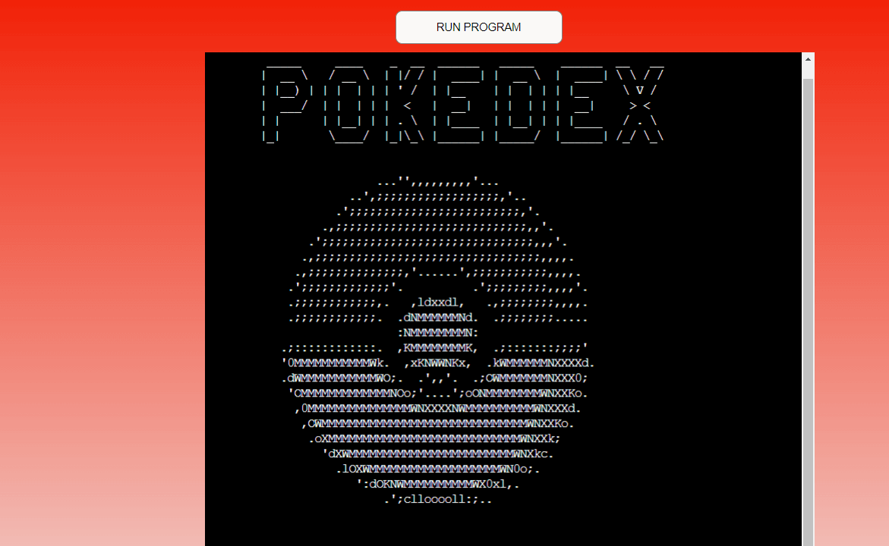
    
   3. #### Main menu:
    The main menu then displays which displays the various sections within the app and allows the user to input and decide which action they want to take.
    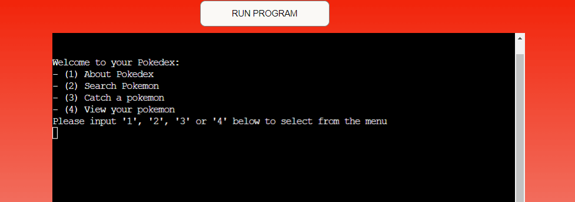
    
   4. #### About Pokedex:
    Option (1) in the menu opens the 'About Pokedex' section. This simply gives a description of the application and can be the first port of call for a new user, to understand the purpose of the application if it is not immediately apparent to them.
    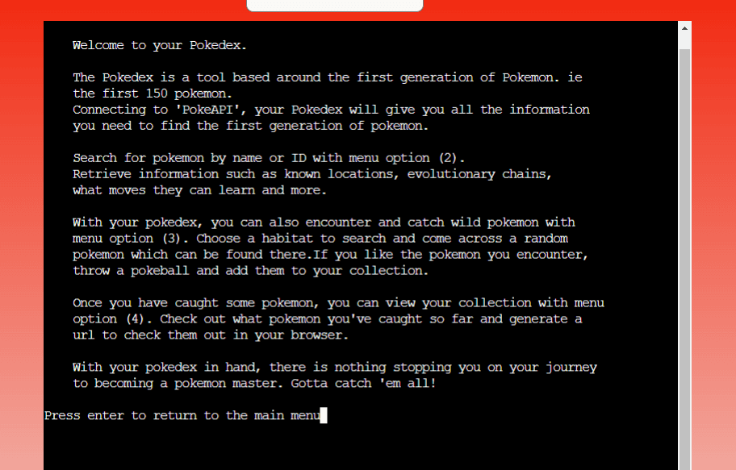
    
    5. #### Search pokemon:
    This feature allows a user to search for information on a desired Pokémon by entering its name or ID. If a user does not have any prior knowledge, the prompt in the input text to input a number from 1-150 will allow them to easily bring up a Pokémon and display its info depending on what random number they choose.
    
    
    Once a name or ID has been selected, two samples of 'flavour text' are displayed which are bite-sized pieces of information on the selected Pokémon. These are taken from the original Gameboy game. When a Pokémon was caught and could be viewed in the pokédex within the game, these pieces of text were displayed along with the Pokémon's stats.
    Below this, another menu displays which asks the user what information they would like to get about the selected Pokéemon. The user can input based on the number listed next to the option or input 7 to return to the main menu.
    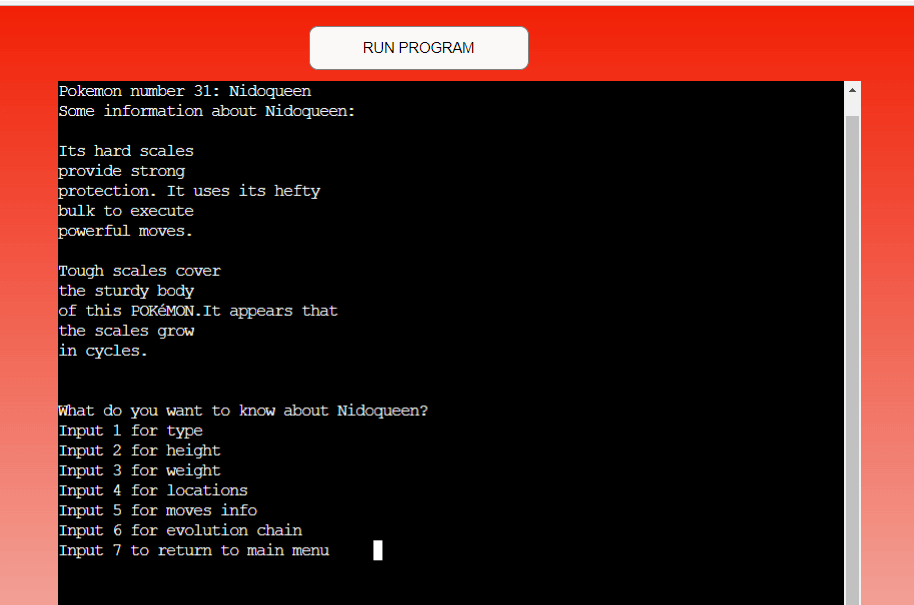
    
    6. #### Catch pokemon:
     This feature allows the user to 'encounter' a 'wild' Pokémon, randomly generated from the selected habitat. 
     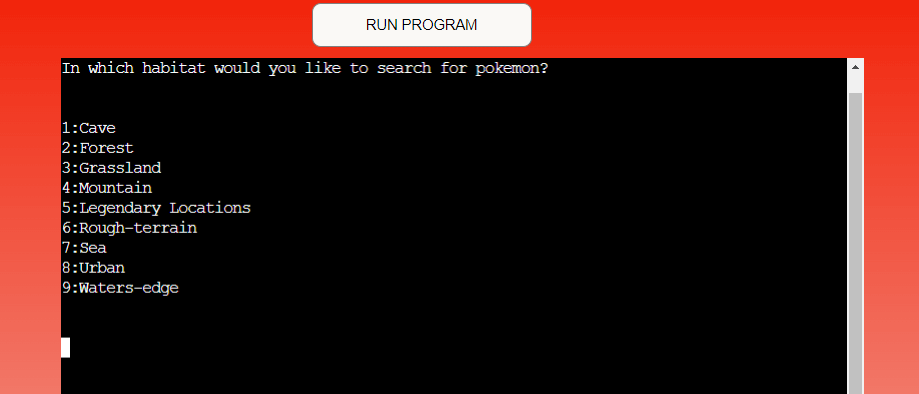
      
     Users can look up information about the randomly encountered pokemon or choose to 'catch' it. If the pokemon is caught, it is stored in the associated google sheet under their trainer name so that it can be accessed for future reference. This is how a user can collect a roster of their own pókemon within the app.
     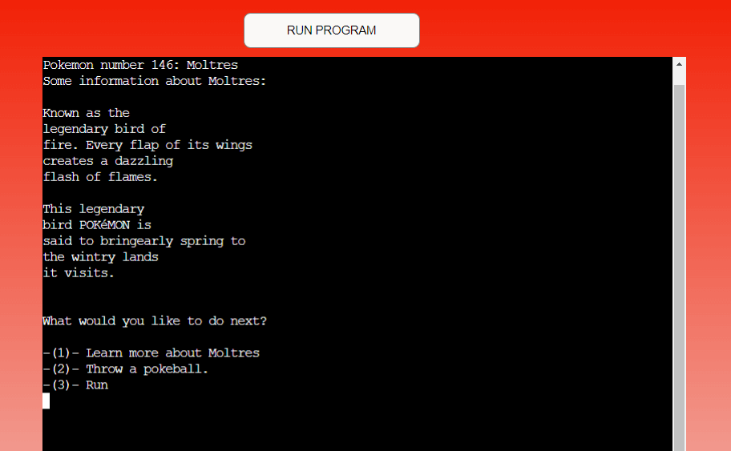

     A menu gives the user three options:

     * They can learn more about the pokemon. This runs the same function and generates the same menu as if the pokémon had been searched for with option (2) in the main menu. The user will see that the pokemon is no longer available to catch through a message advising them the pokemon fled.
     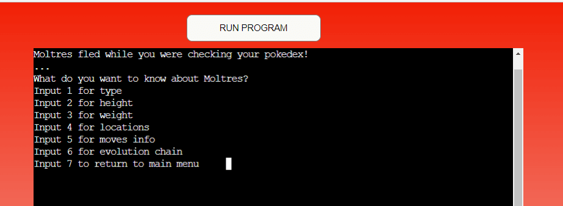

     * Describing the 3rd option next, users can simply 'Run' from the pokémon. This is a similar option as to one which is offered to users of the game series if they encounter a wild Pokémon. This simply displays a message to the user and brings them back to the main menu.
     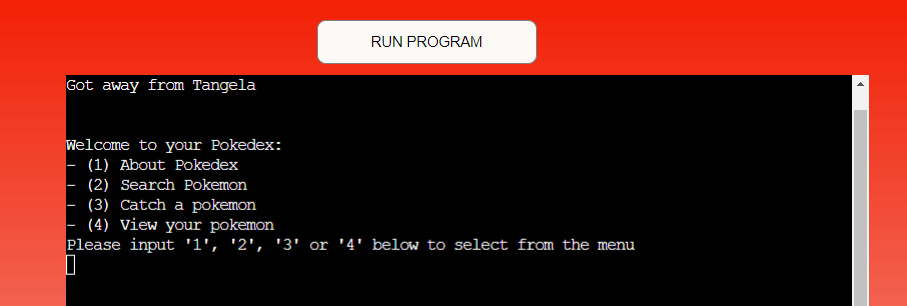

     * The second option for users is to 'throw a pokéball' and 'catch' the encountered pokémon. This again mimics the game series in how it displays a message to the user congratulating them on catching the wild pokemon.
     

     As mentioned above, if the user decides to catch the pokémon, it is stored below their trainer name in the associated google sheet so that it can be viewed and accessed in the future.
     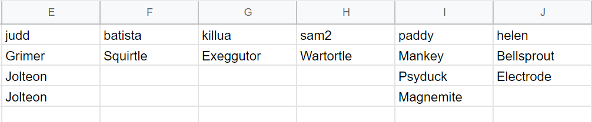
      
    7. ####  View caught pokémon:
    Lastly, with this feature, users can see their roster of previously caught pokemon, taken fromt he data stored in the associated google sheet. The caught pokemon displays as a numbered list, this will act as a guide for the user input option which follows this display.
    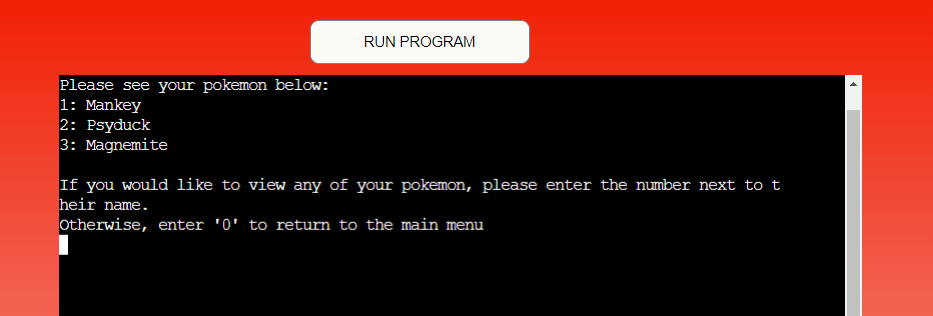
    
    The final option open to users of the app is to generate a url to see what their Pokémon looks like. Within the PokéAPI, there are what is known as 'sprite images' that can be accessed. These are images from various versions of the games and official artwork of the Pokémon. Upon inputting the number next to the desired Pokémon, a url is provided to paste into browser along with a warning not to use the Ctrl + C shortcut to copy as this will exit out of the program.
    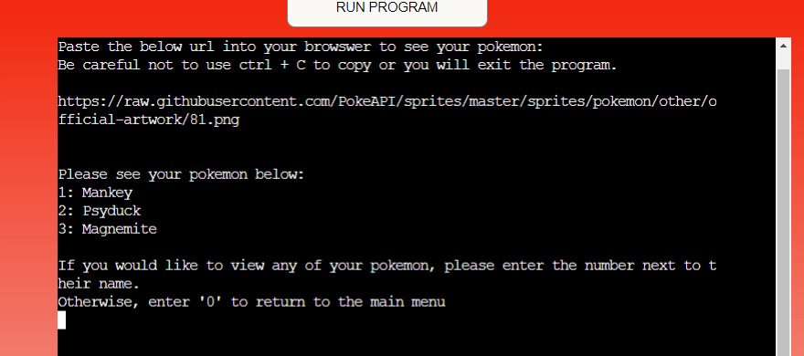
    
    This url is generated from a separate worksheet named sprite-data, which updates the coinciding cell, which is updated with the Pokémon name when it is caught.
    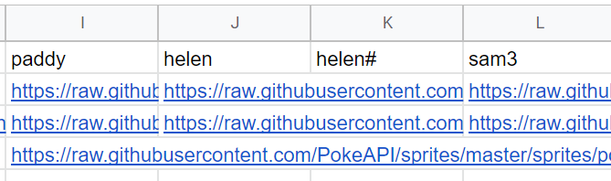
    
 * ### Features to implement:
  There are a few features to implement in future:
  * The ability to delete Pokémon from your roster. This has not yet been implemented as I did not want to over complicate the flow of the application for the sake of presenting a clear portfolio project.
  * Within the catch Pokémon menu option, to go further than just the habitats and to be able to search specific locations linked to the maps in the original Gameboy games for pokemon is something that would be possible to do using the PokéAPI, however, again, I did not wish to overcomplicate the application and to implement the numerous extra menu options this would require seemed an unecessarily laborious task for the brief of this project.
  * To code a full backend in this application which would allow users to trade Pokémon they have caught, as one could in the original games, is an end-goal for this application. This is, however, outside of my ability at this stage of the course and not within the scope of this project.

* ## Testing:

The vast majority of the testing when building the site took place in the Gitpod terminal. As this project runs in a mock terminal, it was the ideal place to try while building. After deployment all tests with regards the sections and features of the site took place again to ensure deployment did not cause any previously unknown bugs.

As this application leans heavily on user input, a number of try/except statements have been implemented. Ensuring exceptions were handled correctly and correct feedback was provided to the user when errors occurred formed a large part of the overall testing.
 * ### Manual testing:
  * #### Enter trainer name:
   * At the beginning of the application, the user is asked to provide their name and they are then taken to the landing page. Testing was conducted to ensure returning users were welcomed back:
   
   
   * Conversely, if a user hit enter without inputting a trainer name, the latter sections such as catching Pokémon and viewing Pokémon would not work with no trainer name to return results. Therefore, testing of the exception that is raised if an empty input is provided was necessary.
   
  
  * #### Main Menu:
    * Input from the user for the main menu was tested to ensure any invalid inputs raised a Value Error correctly. Empty, invalid numeric and alphabetical inputs raise an exception and provide feedback to the user. It was verified that inputting 1,2,3 or 4 will bring users to the relevant sections.
    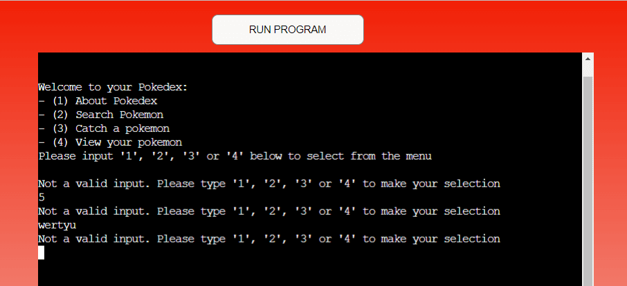
    
  * #### About Pokedex:
    * This section was manually tested to ensure it could be opened, read clearly and that any input by the user would bring back to the main menu once they pressed enter.
  * #### Search Pokemon:
    * The correct handling of invalid user input was also tested at this section. As prompted, only the correct spelling of a first generation Pokémon or ID in the range of 1-150 will be accepted. Empty, invalid numerical or alphabetical input will correctly raise a Value Error as an exception and ask again for the user input.
    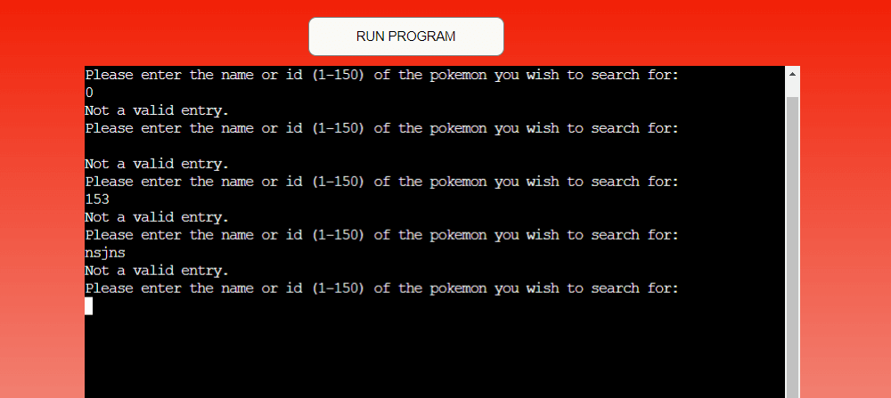
    
    * The menu options for what information the user wants to know about the selected Pokémon were all verified to be functioning correctly. For example, in location info, some string elements when called from the API are replaced to be more readable. eg. '1f' becomes 'First Level', '2bf' become 'Second level underground'. These occurences were tested and verified.
    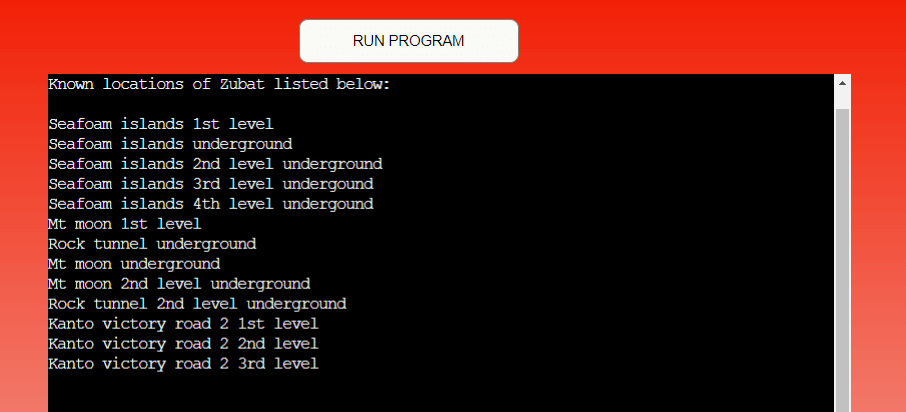
    
    * Again, testing for Value Errors raised as an exception due to invalid user input was also tested to ensure feedback was given and the menu regenerated.
    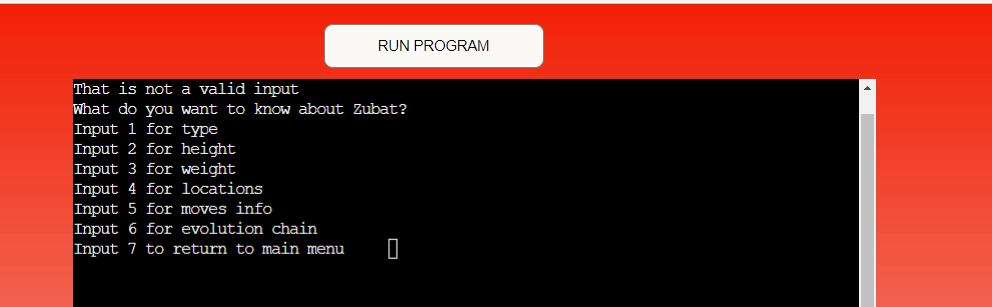
    
  * #### Catch pokemon:
    * User input is required to select a habitat in which to search for a Pokémon to catch. Invalid inputs raise a Value Error as an exception and ask the user to re-enter their choice. It was noticed at this stage, that an invalid input of '0' was actually causing a negative index due to how the function was coded and selecting habitat 9: Waters-edge. 
    ```selected_habitat = available_habitats[habitat_id_selected - 1]```
    * An if/else statement was implemented to deal with this. If user input is in the range(1,10), a habitat is selected. Otherwise, a Value Error is raised.
    * After the wild Pokémon is encountered, there is another menu option for the user. Only 1, 2 and 3 serve as valid input options. During testing it was noticed that no function was called following a Value error which caused the application to crash. This was fixed by calling the previous function in the case of a value error.
    * As this clears the console in the deployed version, please see screenshot of the gitpod terminal below of feedback given to user when after and invalid input with the clear_console function disabled.
    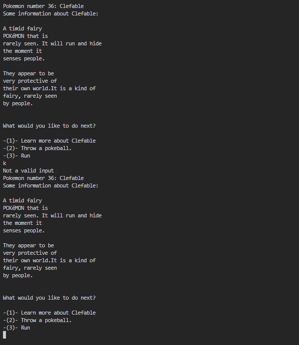
    
  * #### View Caught Pokemon:
    * As the list of caught Pokémon is taken from column containing the trainer's name, the first test was to ensure that was not printed with the list of Pokémon. This can be verified in the screenshot from the features section.
    * When choice of pokémon was made, it was also tested that the correct url was generated and that each was assigned to the correct cell in the sprite-data worksheet.

 * ### Code Validation:
  * To ensure the python code written was in line with pep8 standards, it was ran through a [Pep8 online check](http://pep8online.com/). The code returned no errors.
  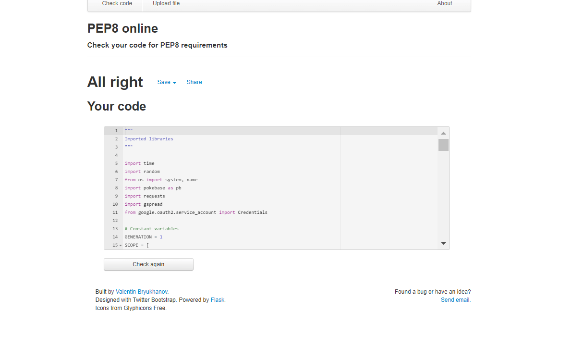
  
 * ### Bugs:
   * There were numerous bugs encountered during the building of the application. Some examples are listed below:
     * One such bug came when dealing with API resources and trying to apply methods to them.
     * For example, the use of capitalize() did not bring the expected results could not be called on Pokémon names called using the imported pokebase library. This was resulting in an Attribute Error being raised. See below:
     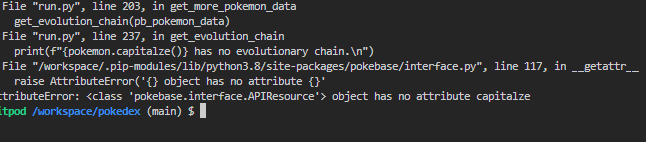
     
     * This was a necessary method to implement for many of the functions called in the application. To fix this issue, the API resource was converted to a string before applying the method:
     ```capitalized_pokemon = str(pb_pokemon_data).capitalize()```
   
   * I encountered another bug trying to implement the View Caught Pokemon section of the application. While trying to call view_caught_pokemon if the main menu choice was 4, my print statement within the function seemed to be causing a Value Error: 
   	* I wanted to have the index of the Pokemon listed next to the Pokemon name. Two attempted methods of achieving this resulted in a Value Error:   
   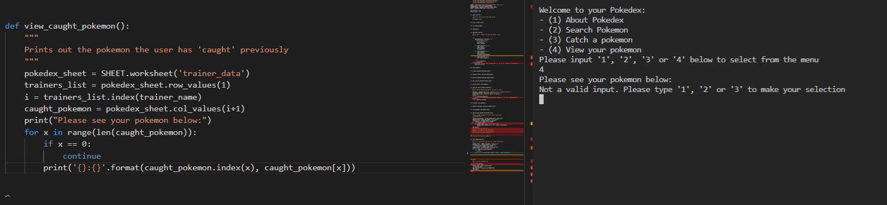
   
   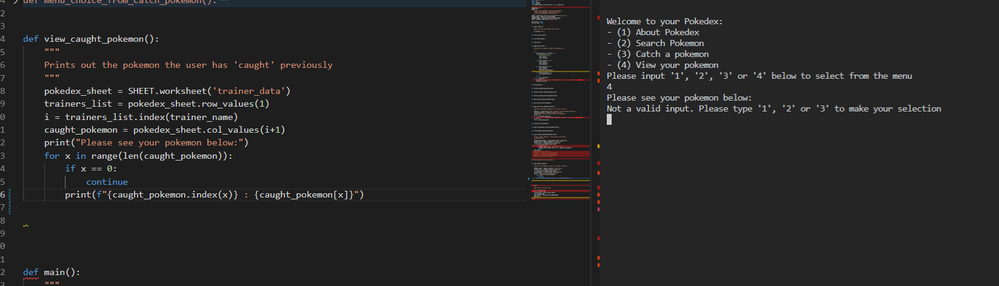
    
    * In fact, simplifying my print statement, gave the desired results and resulted in no Value Error being raised:
    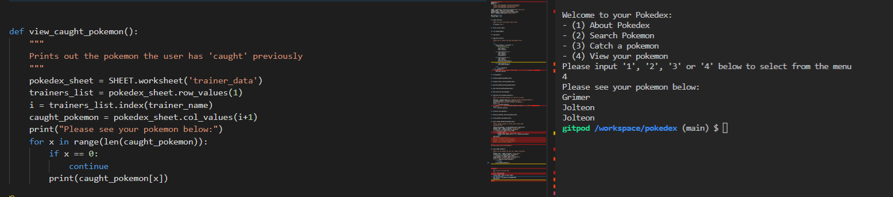
  
  * Another bug found when the application was deployed was related to the mock terminal and clear_console. 
    * In clearing the console, only the text visible on screen was deleted. All text in the terminal not visible on the screen, remained above and could be scrolled up to and viewed. This was very displeasing from a visual point of view for the user.
    * In particular, the get_moves_info function which listed a large number of results, often spanned more than the height of the terminal, even after further rows were added.
    * To get around this, the results were instead added to a list and the list was printed, using the join() method to remove the square brackets and apostrophes.
     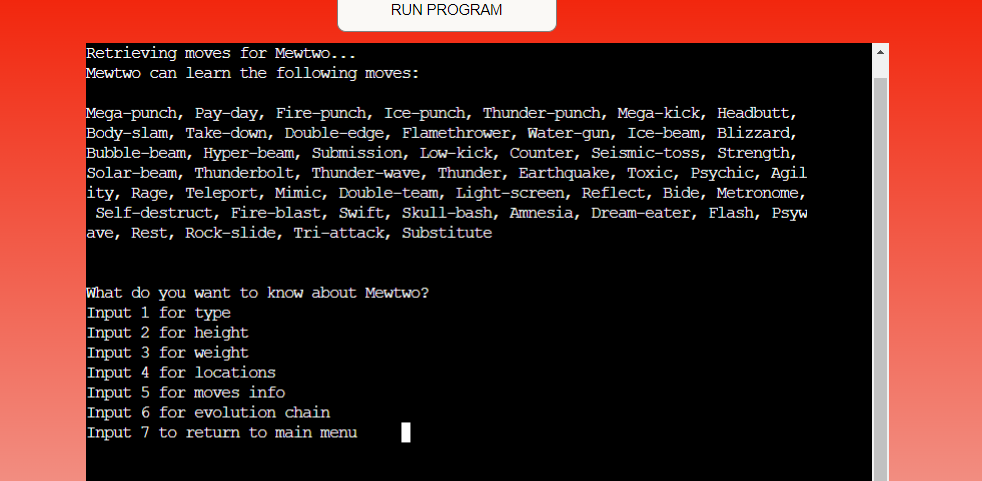
     
  * ### Unfixed bugs:
  Unfortunately, there are one or two unfixed bugs, relating to the use of the mock terminal and the API calls.
   * Above in the image relating to the fix for get_moves_info function, it can be see that the elements of the list to not justify when printed out which means that some words go onto a new line rather than dropping down to the line below. This is the nature of the mock terminal used and so this has been left unfixed for now.
   * Another bug relates to the API calls for the flavour text. Within the API, there are some spacing & spelling errors in the flavor texts which result in some words split over two lines or no spaces between words in some cases. For example:
   1. Flavour text printed to terminal:
    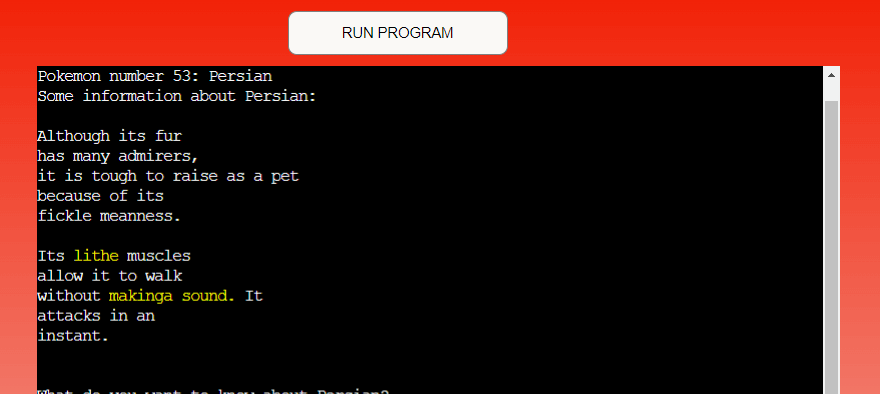
    
   2. Flavour text called from PokeAPI:
    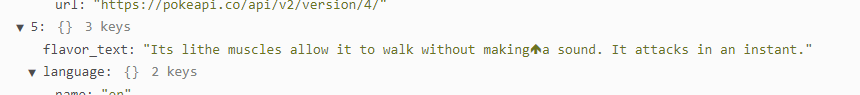
    
   * Replacing the up arrow with either an empty parenthesis or a space is a double edged sword. Replacing with a space can cause words to stretch over 2 lines. Replacing with an empty parenthesis causes some spacing errors.
   * I feel as though this bug, while irritating, owes to the API and is not so off-putting the user as to remove the flavour text from the app. Printing this text also calls back to the original game series and so the choice was to leave this in as is. I hope to find a fix for it in the future.

* ## Deployment
     This app was deployed using [Heroku](heroku.com). Once you have an active account, follow these steps to deploy.
     1. Navigate to your dashboard and click the "Create App" button.
     2. Proceed to the settings tab and click on "config vars".
     3. Here, supply a KEY of "PORT" and a VALUE of "8000". Click "Add".
     4. If required, as is in this project, add a KEY of "CREDS" and a VALUE of credentials listed in a txt file named requirments.txt.
     5. Click "Add Buildpack".
     6. Add the required buildpack. In this case, add the 'python' and 'nodejs' buildpacks in that order. Ensure they are listed as such.
     7. Navigate to 'Deploy', select Github as your deployment method and connect your Github profile.
     8. Search for the repository you wish to deploy and select 'Connect'.
     9. Choose to manually or automatically deploy your project.
     10. If build is successful, click the link provided to you to view your deployed site.

* ## Technologies used:
  * This site was built using python and some modules and external libraries were imported to make it functionality possible:
   1. ['time'](https://docs.python.org/3/library/time.html) was imported in order to use the 'sleep' method.
   2. ['random'](https://docs.python.org/3/library/random.html) was imported to help make a a random choice in the encounter_wild_pokemon function.
   3. [from 'os', 'system' and 'name'](https://docs.python.org/3/library/os.html) were imported to help create the clear_console function.
   4. ['pokebase'](https://github.com/PokeAPI/pokebase) was imported. This is a python wrapper associated with PokeAPI and includes some simplified methods for calling information from the API.
   5. ['requests'](https://docs.python-requests.org/en/latest/) was imported to simplify the calls to the API.
   6. ['gspread'](https://docs.gspread.org/en/v5.3.2/) was imported for the purpose of linking the Google sheet to the application and using the associated methods to provide data to, and call data from, the associated Google sheet.
   7. 'from google.oauth2.service_account import Credentials' was used to link and allow the app access to information, namely Google sheets, in my Google account.
  
  * This application is based around the use of [PokéAPI](https://pokeapi.co/) which is an API containing information relating to the Pokémon series and the associated Gameboy games.
  * This application was built in [Gitpod](gitpod.io) and pushed to a repository in [Github](https://github.com/). The application was deployed using [Heroku](heroku.com) which was linked to this repository in Github.
  * The flow-charts used to plot the design of the application were made with [Lucid Chart](https://www.lucidchart.com/).
  * [TinyPNG](https://tinypng.com/) was used to compress the size of the images used in the README.md.
  * The python code written for this application was validated through [pep8online.com](http://pep8online.com/).

* ## Credits:
 * First and foremost, credit is due to the Pokémon series on which this application is based.
 *  All pokémon data is taken from [PokéAPI](https://pokeapi.co/). The [Pokebase python wrapper](https://github.com/PokeAPI/pokebase) and associated [documentation](https://pokebase.readthedocs.io/en/latest/examples/index.html) provided some simple solutions with the available methods.
 * The landing image was created with the help of [ascii-art-generator.org](https://www.ascii-art-generator.org/) & [patorjk.com](https://patorjk.com/software/taag/#p=testall&h=3&f=Doh&t=P%20O%20K%20E%20D%20E%20X).
 * The favicon was taken from [favicon.cc](https://www.favicon.cc/?action=icon&file_id=875676).
 * The code was developed by myself. The basis of my python knowledge comes from my current course with [Code Insitute](https://codeinstitute.net/ie/). Any code taken from external sources is credited in the code.
 * I would also like to thank the Tutor Support and my mentor Akshat.


   
    
    
  

    
   

    
    
   
    
 
